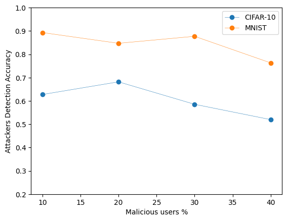
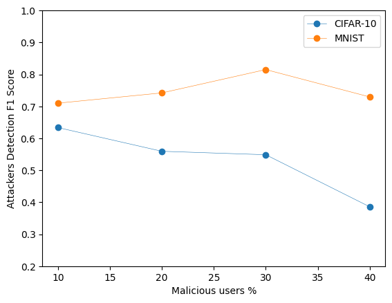
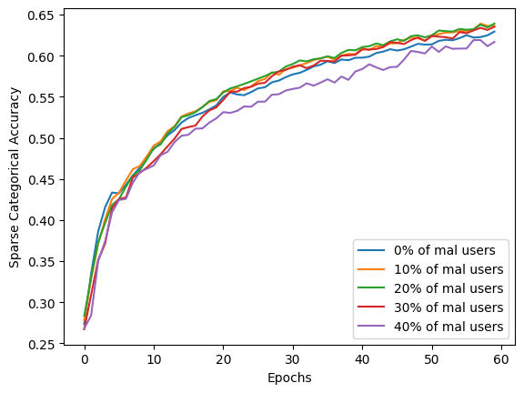
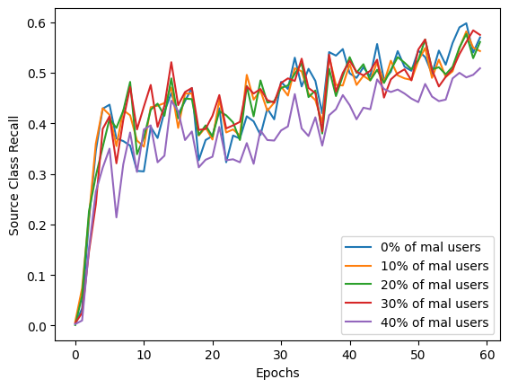

# Defense Against Data Poisoning Attacks in Federated Learning via User Elimination

This repository contains the technical implementation of the paper (TODO), as well as proof of its results.

## Abstract

Federated Learning (FL) has emerged as a powerful paradigm for training machine learning models in a privacy-preserving and efficient manner by leveraging distributed data sources. However, it is proven that FL is vulnerable to data poisoning attacks where malicious users intentionally harm the model by contributing harmful updates[1]. This paper introduces a novel defense mechanism that identifies and eliminates malicious users based on their training loss and updates, employing Local Differential Privacy (LDP) to ensure privacy preservation. Our approach not only maintains the integrity and performance of the FL model but also ensures user privacy.

## Introduction

As machine learning models become increasingly integrated into our daily lives, we must work towards ensuring their reliability and security against malicious attacks, such as the ones mentioned. Federated Learning, while offering significant advantages in terms of privacy and efficiency, is susceptible to data poisoning attacks, which can severely impact model performance by introducing malicious updates during the training process. 

Our research focuses on developing a defense mechanism that can effectively mitigate the effects of these attacks by detecting and excluding malicious participants without compromising a core promise of FL: data privacy.

## Solution Overview

Our solution utilizes a novel approach that leverages metadata, specifically the training loss reported by users, in combination with robust Data Privacy techniques to identify malicious behaviour. By applying LDP to the reported losses, we ensure that the process remains privacy-preserving, and that no data is leaked to the central aggregating authority. The core idea is to analyze the differential private training losses to distinguish between honest and malicious user updates, thus protecting the FL model from being poisoned.

## Implementation

The repository is structured as follows:

- `DefenseFederated`: Contains the main implementation of our defense mechanism.
  - `checkpoint.pth`, `mnist.pth`: Pre-trained model checkpoints for quick experimentation.
  - `experiments`: Directory containing visualizations of attackers' accuracy and F1 scores, alongside CIFAR and MNIST datasets' specific results.
  - `src`: Source code including the federated learning framework, model definitions, and utility scripts for data handling and experiment running.

- `DefenseTraditionalML`: Notebooks and scripts demonstrating the application of our defense mechanism to traditional machine learning settings, showcasing its versatility.

- `LaunchingAttacks`: Tools and notebooks designed for simulating data poisoning attacks on federated learning models, used to evaluate the robustness of our defense mechanism.

## Sample Results

Below are some sample images from our experiments on the MNIST and CIFAR-10 datasets, illustrating the defense mechanism's effectiveness in maintaining model performance despite data poisoning attacks:

 

This graph offers insights into how accurately our defense mechanism can identify and eliminate malicious users attempting to poison the model. A high performance in accuracy and F1 score in this tasks indicates a robust defense capability, while ensuring the integrity of the FL process.

 

This figure illustrates the improvement in 2 different metrics:
 - accuracy 
 - recall for a specific class targeted by the poisoning attack

With those metrics we emphasize the defense's effectiveness in ensuring that the model remains reliable and accurate in classifying instances, despite attempts to undermine its performance.

These images highlight the robustness of our FL model against data poisoning attacks, underscoring the efficacy of our user elimination strategy.

## Conclusion

Our approach introduces a reliable and privacy-preserving method to safeguard Federated Learning models against data poisoning attacks. By combining the principles of Local Differential Privacy with innovative anomaly detection techniques, we ensure both the integrity of the learning process and the privacy of participating users.

For detailed implementation and to replicate our experiments, refer to the `src` directory and follow the setup instructions provided within each sub-directory.

## Aknowledgments

This work was conducted as part of my Master's Dissertation for the MSc in Information Security at the University College London (UCL), with the help and guidance of my supervisor Prof Emiliano De Cristofaro (University of California, Riverside), and of Prof Lorenzo Cavallaro (UCL).